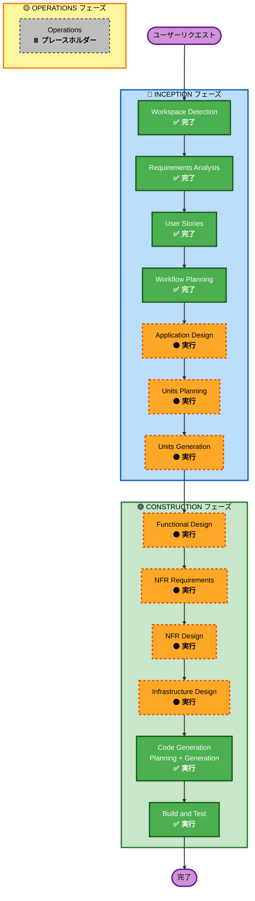

# 実行計画 - どんMai

## 詳細分析サマリー

### トランスフォーメーションスコープ
- **プロジェクトタイプ**: Greenfield（新規開発）
- **主要な変更**: 新規 Web アプリケーション開発（フロントエンド + バックエンド + AI 統合）
- **関連コンポーネント**: SvelteKit フロントエンド、AWS Lambda バックエンド、Amazon Bedrock AI、Amazon Cognito 認証、AWS DynamoDB データベース

### 変更影響評価
- **ユーザー向け変更**: はい - 複数の新規機能（言い訳生成、懺悔室、オンボーディング、サボり肯定ポップアップ）
- **構造的変更**: はい - 新規システムアーキテクチャ（フロントエンド + サーバーレスバックエンド）
- **データモデル変更**: はい - DynamoDB スキーマ（ユーザー設定、トークン使用量、言い訳履歴）
- **API 変更**: はい - 複数の新規 API エンドポイント（言い訳生成、懺悔室、認証、課金）
- **NFR 影響**: はい - パフォーマンス、セキュリティ、スケーラビリティ要件

### コンポーネント関係
```
フロントエンド (SvelteKit)
  ├── オンボーディング UI
  ├── 言い訳生成 UI
  ├── 懺悔室 UI
  ├── サボり肯定ポップアップ
  └── 設定 UI

バックエンド (AWS Lambda)
  ├── 認証エンドポイント (Cognito)
  ├── 言い訳生成エンドポイント (Bedrock)
  ├── 懺悔室エンドポイント (Bedrock)
  ├── トークン管理エンドポイント
  ├── プラン管理エンドポイント
  └── 攻撃判定エンドポイント

データレイヤー (DynamoDB)
  ├── ユーザーテーブル
  ├── トークン使用量テーブル
  └── 言い訳履歴テーブル

AI レイヤー (Amazon Bedrock)
  ├── Claude Haiku (Free プラン)
  └── Claude Sonnet (Pro プラン)

認証レイヤー (Amazon Cognito)
  ├── ユーザープール
  └── ソーシャルログイン (Google)

ホスティング (CloudFront + S3)
  └── SvelteKit 静的ファイル
```

### リスク評価
- **リスクレベル**: 中 - 複数の AWS サービス統合、AI API 呼び出し、認証・課金ロジック
- **ロールバック複雑度**: 中 - インフラストラクチャは IaC（AWS CDK）で管理されているため、ロールバックは比較的容易
- **テスト複雑度**: 複雑 - 複数のコンポーネント間の統合テスト、AI API のモック、認証フロー、課金フロー

---

## ワークフロー可視化



---

## 実行フェーズ

### 🔵 INCEPTION フェーズ

#### ✅ 完了したステージ
- [x] Workspace Detection (COMPLETED)
- [x] Requirements Analysis (COMPLETED)
- [x] User Stories (COMPLETED)
- [x] Workflow Planning (IN PROGRESS)

#### 🟠 実行するステージ

**Application Design - EXECUTE**
- **理由**: 複数の新規コンポーネント（フロントエンド、バックエンド、AI 統合、認証、課金）が必要で、コンポーネント間の依存関係と責務を明確にする必要がある
- **成果物**: コンポーネント図、コンポーネント責務定義、サービス層設計

**Units Planning - EXECUTE**
- **理由**: 複数のユニット（オンボーディング、言い訳生成、懺悔室、認証、課金、キャラクター管理等）に分解する必要があり、複数チームでの並列開発が可能
- **成果物**: ユニット分解図、ユニット依存関係、ユニット優先度

**Units Generation - EXECUTE**
- **理由**: 各ユニットの詳細な実装計画を生成し、開発チームが並列で作業できるようにする
- **成果物**: ユニット別の実装計画、ユニット間の統合ポイント

### 🟢 CONSTRUCTION フェーズ

#### 🟠 実行するステージ（ユニットごと）

**Functional Design - EXECUTE**
- **理由**: 複雑なビジネスロジック（トークン管理、プラン切り替え、キャラクター分岐、攻撃判定）が必要で、詳細な設計が必要
- **成果物**: ビジネスロジック設計、状態遷移図、エラーハンドリング設計

**NFR Requirements - EXECUTE**
- **理由**: パフォーマンス（3 秒以内の応答）、セキュリティ（認証、プロンプトインジェクション対策）、スケーラビリティ（Lambda オートスケール）が重要
- **成果物**: NFR 要件定義、パフォーマンス目標、セキュリティ要件

**NFR Design - EXECUTE**
- **理由**: NFR 要件を実装するための設計が必要（キャッシング戦略、セキュリティパターン、スケーリング戦略）
- **成果物**: NFR 設計、パフォーマンス最適化戦略、セキュリティ実装戦略

**Infrastructure Design - EXECUTE**
- **理由**: AWS サービス（Lambda、API Gateway、DynamoDB、Cognito、Bedrock、CloudFront、S3）の統合が必要で、インフラストラクチャ設計が必須
- **成果物**: AWS CDK スタック設計、ネットワーク設計、セキュリティグループ設計

**Code Generation - EXECUTE (ALWAYS)**
- **理由**: 実装計画に基づいてコードを生成する
- **成果物**: フロントエンドコード、バックエンドコード、インフラストラクチャコード、テストコード

**Build and Test - EXECUTE (ALWAYS)**
- **理由**: ビルド、テスト、検証が必須
- **成果物**: ビルド成果物、テスト結果、検証レポート

### 🟡 OPERATIONS フェーズ
- [ ] Operations - PLACEHOLDER
  - **理由**: 将来のデプロイメントと監視ワークフロー用のプレースホルダー

---

## ユニット分解戦略

### 推奨ユニット構成

```
Unit 1: オンボーディング・認証
  - ランディングページ
  - デモ体験
  - アカウント登録
  - プラン選択
  - シーン選択
  - Cognito 認証統合

Unit 2: 言い訳生成コア
  - 言い訳生成エンドポイント
  - Claude Haiku/Sonnet 統合
  - トークン管理
  - 言い訳履歴管理

Unit 3: 懺悔室・肯定機能
  - 懺悔室エンドポイント
  - 肯定メッセージ生成
  - サボり肯定ポップアップ

Unit 4: 課金・プラン管理
  - Pro プラン購入
  - AWS Marketplace 統合
  - トークン制限ロジック
  - Pro 誘導モーダル

Unit 5: キャラクター・UI
  - キャラクター表示ロジック
  - キャラクター分岐ルール
  - 攻撃入力検知
  - UI コンポーネント

Unit 6: インフラストラクチャ・デプロイメント
  - AWS CDK スタック
  - CloudFront + S3 ホスティング
  - API Gateway 設定
  - CloudWatch ログ・監視
```

### ユニット依存関係

```
Unit 1 (オンボーディング・認証)
  ↓
Unit 2 (言い訳生成コア) ← Unit 4 (課金・プラン管理)
  ↓
Unit 3 (懺悔室・肯定機能)
  ↓
Unit 5 (キャラクター・UI)
  ↓
Unit 6 (インフラストラクチャ・デプロイメント)
```

### 並列開発可能性

- **並列開発可能**: Unit 1, Unit 2, Unit 4 は部分的に並列開発可能
- **依存関係**: Unit 3, Unit 5 は Unit 2 の完了後に開始
- **統合テスト**: Unit 6 で全ユニットの統合テストを実施

---

## 推奨実行順序

### INCEPTION フェーズ
1. ✅ Workspace Detection (完了)
2. ✅ Requirements Analysis (完了)
3. ✅ User Stories (完了)
4. ✅ Workflow Planning (進行中)
5. 🟠 Application Design (次)
6. 🟠 Units Planning
7. 🟠 Units Generation

### CONSTRUCTION フェーズ（ユニットごと）
8. 🟠 Functional Design (Unit 1)
9. 🟠 NFR Requirements (Unit 1)
10. 🟠 NFR Design (Unit 1)
11. 🟠 Infrastructure Design (Unit 1)
12. ✅ Code Generation (Unit 1)
13. [Unit 2-5 に対して同じプロセスを繰り返す]
14. ✅ Build and Test (全ユニット)

### OPERATIONS フェーズ
15. ⏸️ Operations (プレースホルダー)

---

## 推定タイムライン

| フェーズ | ステージ | 推定期間 |
|--------|--------|--------|
| INCEPTION | Application Design | 1-2 日 |
| INCEPTION | Units Planning | 1 日 |
| INCEPTION | Units Generation | 1 日 |
| CONSTRUCTION | Functional Design (全ユニット) | 2-3 日 |
| CONSTRUCTION | NFR Requirements (全ユニット) | 1-2 日 |
| CONSTRUCTION | NFR Design (全ユニット) | 2-3 日 |
| CONSTRUCTION | Infrastructure Design (全ユニット) | 2-3 日 |
| CONSTRUCTION | Code Generation (全ユニット) | 5-7 日 |
| CONSTRUCTION | Build and Test | 2-3 日 |
| **合計** | | **17-24 日** |

---

## 成功基準

### 主要ゴール
- MVP 段階での「どんMai」Web アプリケーションの完成
- ハッカソン提出基準の達成

### 主要成果物
- SvelteKit フロントエンド（オンボーディング、言い訳生成、懺悔室、UI）
- AWS Lambda バックエンド（API エンドポイント、ビジネスロジック）
- AWS インフラストラクチャ（CDK スタック、ホスティング、監視）
- テストスイート（ユニットテスト、統合テスト）
- ドキュメント（API ドキュメント、デプロイメントガイド）

### 品質ゲート
- すべてのユニットが正常にビルドされる
- ユニットテストのカバレッジが 80% 以上
- 統合テストがすべてパスする
- パフォーマンステストで 3 秒以内の応答時間を達成
- セキュリティテストで基本的なプロンプトインジェクション対策が機能する

---

## 次のステップ

1. このプランを確認してください
2. 変更が必要な場合は「変更をリクエスト」を選択
3. 承認する場合は「承認して続行」を選択
4. Application Design ステージに進みます

